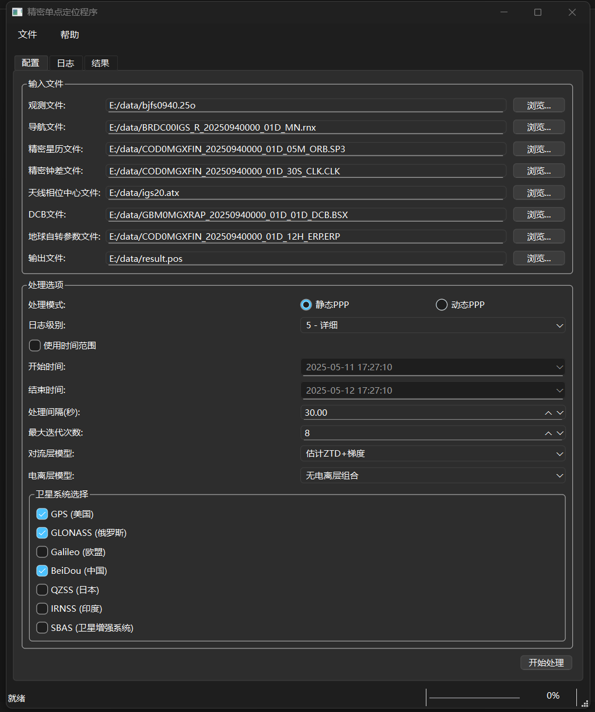
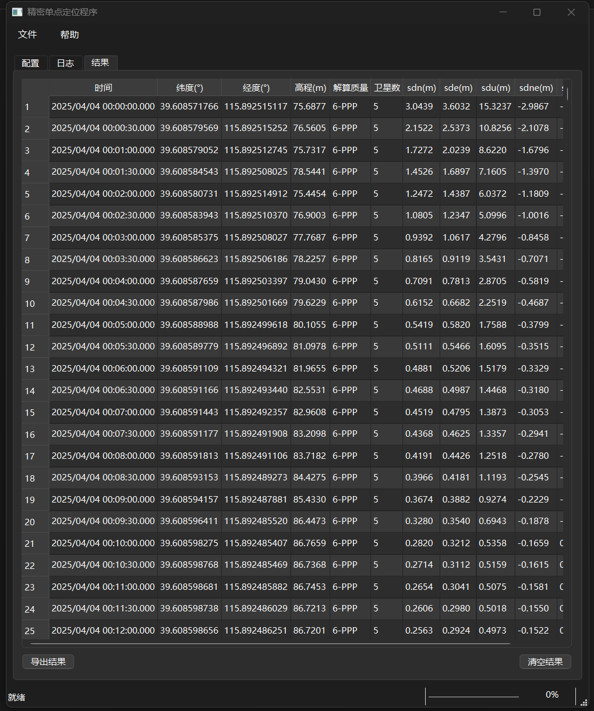

# 精密单点定位程序

## 项目简介

精密单点定位程序是一款基于GNSS观测数据的高精度定位软件，支持静态和动态精密单点定位（PPP）计算。该软件利用精密轨道和钟差产品对单点接收机数据进行高精度处理，无需依赖基准站数据即可实现厘米级的定位精度。

## 功能特点

- **多系统支持**: 支持GPS、GLONASS、Galileo、BeiDou、QZSS和IRNSS等多种全球导航卫星系统
- **精密定位模式**: 提供静态PPP和动态PPP两种处理模式
- **完整的观测数据处理**: 支持多种精密产品输入，包括精密星历、钟差、天线相位中心和DCB产品等
- **灵活的处理选项**: 提供对流层模型、电离层模型和时间范围等多种参数设置
- **结果可视化与导出**: 结果表格显示并支持CSV格式导出
- **日志记录**: 详细的处理日志记录，方便分析处理过程

## 技术细节

- **开发语言**: C++
- **GUI框架**: Qt 6
- **定位精度**: 静态模式下可达厘米级，动态模式下可达分米级
- **输入格式**: 支持标准RINEX格式的观测文件和导航文件
- **精密产品**: 支持IGS精密星历(.sp3)、钟差(.clk)和地球自转参数(.erp)等

## 使用指南

### 基本工作流程

1. **输入文件设置**:
   - 观测文件(.obs): GNSS接收机的观测数据
   - 导航文件(.nav): 卫星广播星历数据
   - 精密星历文件(.sp3): 精密卫星轨道数据
   - 精密钟差文件(.clk): 精密卫星钟差数据
   - 天线相位中心文件(.atx): 天线相位中心改正数据
   - DCB文件: 差分码偏差数据
   - 地球自转参数文件(.erp): 地球自转参数

2. **处理选项配置**:
   - 处理模式: 静态PPP或动态PPP
   - 时间范围: 可选择处理特定时间段
   - 处理间隔: 设置解算间隔
   - 卫星系统选择: 可选择使用的卫星系统组合
   - 对流层模型: 包括Saastamoinen模型等多种选项
   - 电离层模型: 包括广播模型、SBAS模型等多种选项

3. **开始处理**: 点击"开始处理"按钮启动计算

4. **结果查看与导出**:
   - 表格显示处理结果，包括时间、位置、精度信息等
   - 支持导出为CSV格式便于进一步分析

### 高级使用建议

- **静态PPP**: 对于固定站点，建议使用静态PPP模式以获得最高精度
- **多系统组合**: 同时使用多个导航系统可以提高解算可靠性和精度
- **长时间观测**: 静态PPP定位精度随观测时间增加而提高，建议至少观测2小时以上
- **精密产品选择**: 使用最终精密产品(Final)而非快速产品(Rapid)可获得更高精度

### 界面支持

- **浅色和深色模式**: 软件支持浅色和深色模式切换，适应不同的使用环境和用户偏好。

### 界面预览

以下是软件界面的预览图：

配置：

结果：

### 下载与安装

- **可执行文件**: 用户可以从[Release页面](https://github.com/GISer1909/PPP_APP/releases)下载已构建的可执行文件，直接运行无需编译。

## 版权信息

由GISer1909制作，仅供学习交流。All rights reserved.

## 更新日志

### 版本1.0 (2025年5月)
- 首次发布
- 支持多卫星系统PPP处理
- 提供静态和动态两种处理模式
- 完整的处理选项和结果显示功能
